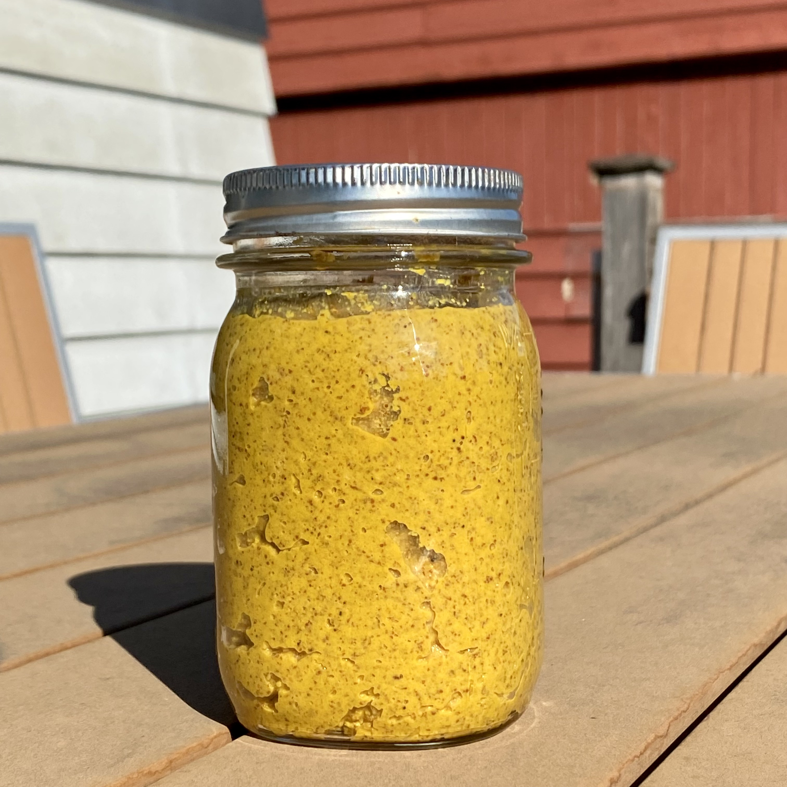

# Homemade Mustard

If you like mustard then once you make homemade mustard you'll never buy it in the jar again

## Basic Mustard Recipe 

This is the basic recipe that I base all my mustards on.

There is a 1 to 1 ratio of whole mustard seeds to liquid:

- mustard seeds: yellow seeds are more mild, black seeds are very sharp and hot kind of like horseradish.
    - I like a mix of 75% yellow, 25% black.
- liquid, 50/50 ratio of 
    - 50% some kind of vinegar: apple cider, white wine.
    - 50% anything else: water, beer, white wine, juice, champagne.

Ingredients:

    - 2/3 cup mustard seeds
    - 1/3 cup some kind of vinegar
    - 1/3 cup some other liquid

Steps:

Put seeds and liquid into a bowl, cover with plastic wrap, and put in fridge for the next 4-5 days. Give the seed mix a stir once a day to make sure all the mustard seeds get fully saturated.

After liquid has been soaked into seeds, put it all into a food processor.

Add 

    - 1 teaspoon ground turmeric
    - 1 teaspoon salt
    - 1 tsp (or more) sugar, honey, or maple syrup for a touch of sweetness

Blend for 5+ minutes until the seeds are mostly puréed...voilà…mustard!

If the mustard is too thick for your tastes, add water 1/2 teaspoon at a time and blend to thin the mustard out.

Additional flavors to add to your mustard. Roast one or more of the following and toss in food processor with the mustard seeds

	- Hot pepper
	- Small sweet onion
	- Garlic
	- Shallots 
	- Pretty much anything you think would be good with mustard

The final thing, and most important, is to taste the mustard and adjust for flavor (usually salt and sweetener). It'll be a bit bitter but that will mellow out over the next few days.

Put mustard into a jar and in the fridge for a couple days for the flavors to meld. This is acidic enough to last several months in the fridge.

## Caramelized Onion and Guinness Mustard

This recipe is my new favorite mustard. Follow the basic recipe above, with the following ingredients.

    - seeds: 75% yellow, 25% black
    - liquid: 50% Guinness beer, 50% apple cider vinegar

Balsamic caramelized onion jam recipe

    - Half yellow onion, sliced thin
    - 1 tbs of sugar
    - 2 tbs balsamic vinegar

Over medium heat, cook onions until translucent. Lower heat a bit and add sugar and balsamic vinegar. Cook stirring often until there is no more liquid balsamic vinegar in the pan and the onions are all caramelly.

Add the following to the food processor with the mustard seeds.

    - onion jam (all of it)
    - 1 habanero
    - 1 tsp lemon juice to brighten it up (more if necessary)
    - Water or vinegar to thin it out if needed

This is REALLY good, not too hot but the caramelized onions really stand out. 
